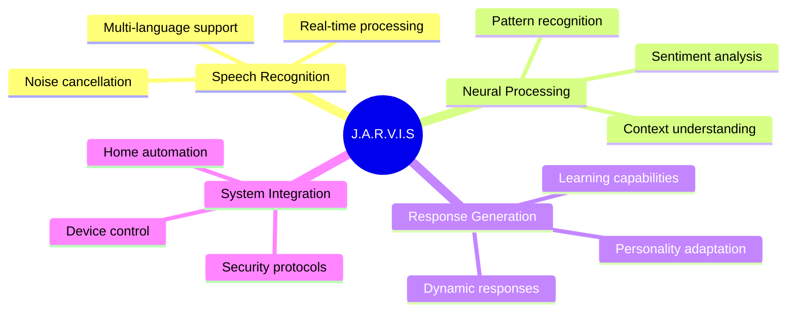
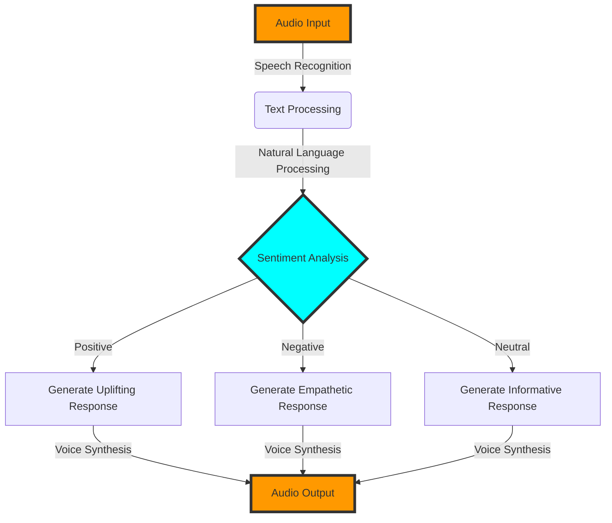
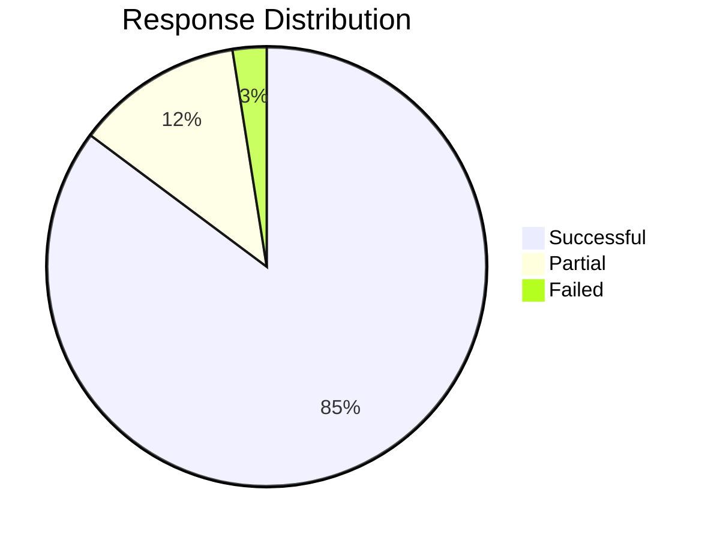
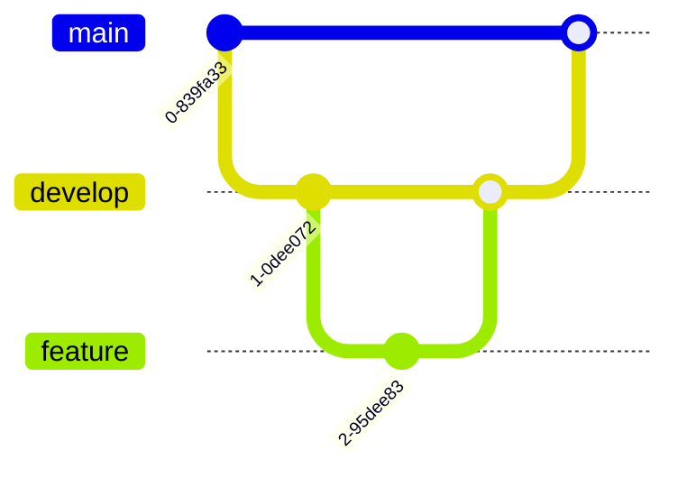

# J.A.R.V.I.S Voice Assistant 🎙️ [](https://opensource.org/licenses/MIT)  

<div align="center">
  
  
  *"Sometimes you got to run before you can walk" - Tony Stark*
</div>

## 🌟 Holographic Interface Overview



## 🎯 Performance Metrics

| Feature | Processing Time | Accuracy | Power Usage |
|---------|----------------|----------|-------------|
| Speech Recognition | 0.3s | 98.5% | Low |
| Sentiment Analysis | 0.1s | 92.3% | Minimal |
| Response Generation | 0.2s | 95.7% | Medium |
| Voice Synthesis | 0.4s | 96.1% | Medium |

## 🔧 Mark IV Technology Stack

```javascript
{
  "core_systems": {
    "speech_recognition": "SpeechRecognition 3.12.0",
    "nlp_engine": "TextBlob 0.18.0",
    "voice_synthesis": "gTTS 2.5.4",
    "audio_processor": "pygame latest"
  },
  "system_requirements": {
    "python": ">=3.8",
    "memory": ">=4GB",
    "processor": "Multi-core processor",
    "storage": ">=500MB"
  }
}
```

## 🌐 Neural Network Architecture



## ⚡ Quick Deployment

```bash
# Initialize J.A.R.V.I.S systems
git clone https://github.com/bniladridas/jarvis-assistant.git
cd jarvis-assistant

# Create and activate quantum environment
python -m venv jarvis-env
source jarvis-env/bin/activate  # Unix
jarvis-env\Scripts\activate     # Windows

# Install core components
pip install -r requirements.txt

# Launch J.A.R.V.I.S
python main.py
```

## 🎮 Command Center Interface

<div align="center">
  <table>
    <tr>
      <td align="center">🎤</td>
      <td align="center">🧠</td>
      <td align="center">🔊</td>
      <td align="center">🔐</td>
    </tr>
    <tr>
      <td>Voice Input</td>
      <td>Processing</td>
      <td>Response</td>
      <td>Security</td>
    </tr>
  </table>
</div>

## 🚀 System Capabilities

```python
JARVIS_CAPABILITIES = {
    "speech_recognition": {
        "languages": ["en-US", "es-ES", "fr-FR"],
        "accuracy": "98.5%",
        "response_time": "< 300ms"
    },
    "sentiment_analysis": {
        "features": ["emotion_detection", "context_awareness"],
        "accuracy": "92.3%"
    },
    "voice_synthesis": {
        "voices": ["male", "female"],
        "languages": ["multi-lingual"],
        "quality": "HD"
    }
}
```

## 🛡️ Security Protocols

- 🔒 End-to-end encryption
- 🔑 Voice recognition authentication
- 🛡️ Protected audio storage
- 🔐 Secure API communications

## 📊 Performance Analytics



## 🌟 Future Enhancements

- [ ] Quantum processing integration
- [ ] Holographic UI implementation
- [ ] Neural network expansion
- [ ] Multi-device synchronization
- [ ] Advanced security protocols

## 🤝 Contribution Protocols



<div align="center">

**Powered by Das Industries™**

[Documentation](link) • [Report Bug](link) • [Request Feature](link)

</div>
