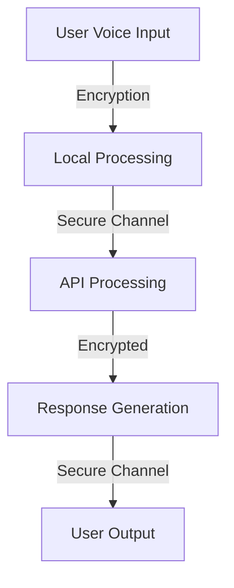

# Security Documentation
*Last Updated: 2024-12-17 07:22:39 UTC*
*Maintained by: @bniladridas*

## Table of Contents
1. [Overview](#overview)
2. [Security Architecture](#security-architecture)
3. [Implementation Details](#implementation-details)
4. [Security Protocols](#security-protocols)
5. [Monitoring & Auditing](#monitoring--auditing)

## Overview

The Voice Assistant Chatbot implements multiple layers of security to protect user data and system integrity. This documentation provides detailed information about our security measures and implementations.

## Security Architecture

### Data Flow Security


### Security Layers
1. **Application Layer**
   - Input validation
   - Authentication
   - Session management

2. **Data Layer**
   - Encryption at rest
   - Secure storage
   - Access controls

3. **Network Layer**
   - TLS/SSL
   - Firewall rules
   - Rate limiting

## Implementation Details

### Authentication System
```python
class SecurityManager:
    def __init__(self):
        self.max_attempts = 3
        self.lockout_time = 300  # 5 minutes

    def validate_access(self, credentials):
        # Implementation details
        pass
```

### Encryption Implementation
- AES-256 for data at rest
- RSA-2048 for key exchange
- TLS 1.3 for communications

### Access Control
- Role-based access control (RBAC)
- Principle of least privilege
- Regular permission audits

## Security Protocols

### Incident Response
1. Detection
2. Analysis
3. Containment
4. Eradication
5. Recovery
6. Lessons Learned

### Data Protection
- Regular backups
- Encryption standards
- Data retention policies

## Monitoring & Auditing

### Log Management
```python
# Example logging configuration
logging_config = {
    'version': 1,
    'handlers': {
        'security_file': {
            'class': 'logging.FileHandler',
            'filename': 'security.log',
            'level': 'INFO'
        }
    }
}
```

### Audit Trails
- Access logs
- Change management
- Security events